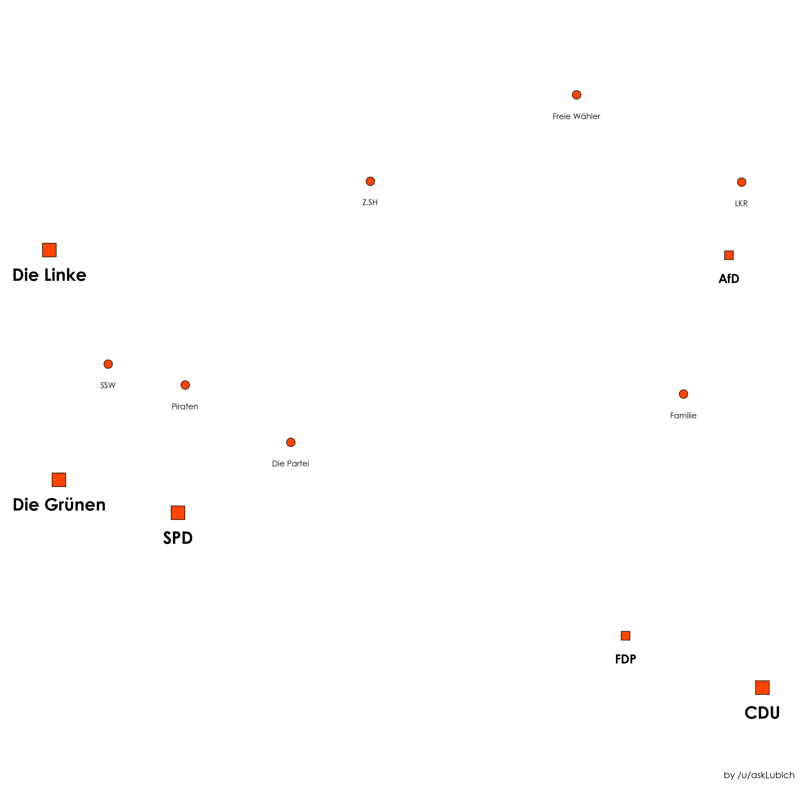

# Analysing the Wahl-O-Mat about the 2016 Schleswig-Holstein election

### Results

The figure below shows how well two political parties aggree (using a normalized L1-distance) based on the answers provided to the Wahl-O-Mat. 
Here, 100% denotes full aggreement.

Figure 2 can bee seen as a "political map". It is the result of a principal component analysis, of which the first principal component (PC1, horizontal axis in the figure)
reproduces a political left-right spectrum. The closer two parties are on the map, the closer they are politically.

### Prerequisites

* Python 2.7
* Jupyter Notebook
* Packages:
    * matplotlib
    * numpy
    
### License

This project is licensed under the GPL-3.0 - see the [LICENSE](LICENSE) file for details.